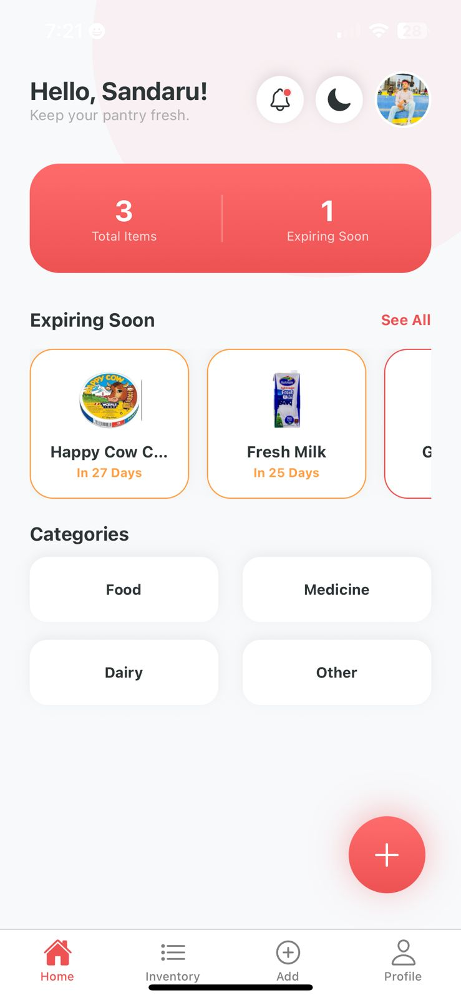
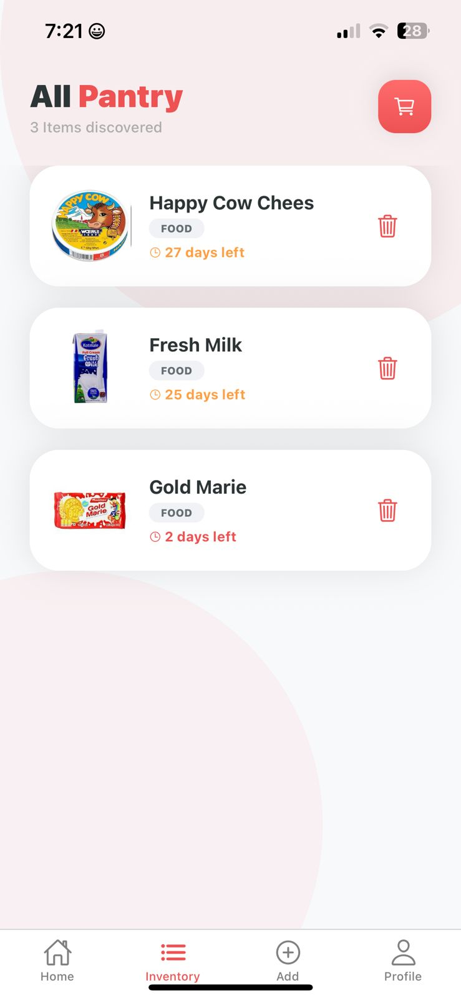
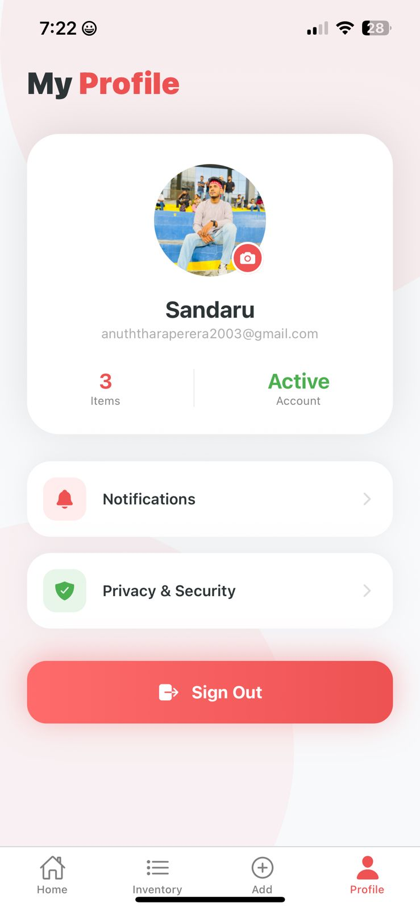
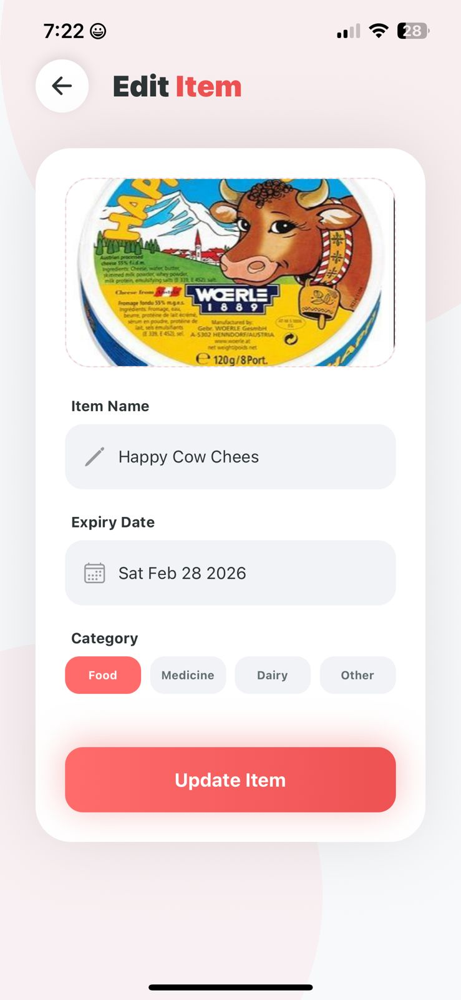
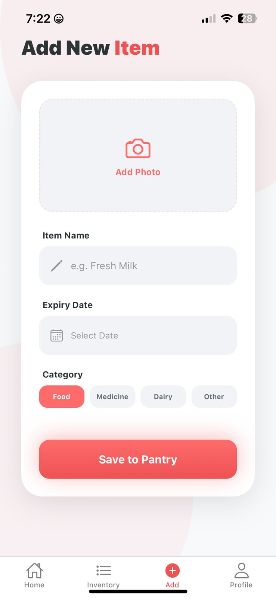

# 🍎 ShelfLife - Smart Expiry Tracker
**ShelfLife** is a premium, cross-platform mobile application designed to reduce household food and medicine waste. It allows users to track items in their pantry or medicine cabinet, providing visual alerts and notifications before they expire. Built with a modern "Coral Red" minimalist design, it offers a seamless experience for managing essentials.

---

## ✨ Key Features
- **User Authentication:** Secure sign-up and login for users using Firebase Authentication.
- **Inventory Management (CRUD):**
  - **Create:** Add new items with names, categories, expiry dates, and product images.
  - **Read:** A real-time dashboard and categorized inventory list.
  - **Update:** Modify item details or update expiry dates easily.
  - **Delete:** Remove items once consumed or discarded.
- **Smart Expiry Logic:** The app automatically identifies items expiring within the next 3 days and highlights them with visual alerts.
- **In-App Notifications:** A dedicated notification screen listing all urgent items requiring attention.
- **Global Theme Switching:** Integrated Light and Dark mode support that stays consistent across all 8 screens.
- **Profile Management:** Users can update their profile picture, display name, and security password.
- **Premium UI/UX:** High-end design utilizing "Coral Red" gradients, soft shadows, animated flash messages, and background decorations.
  
---

## 📸 App Screenshots

| Welcome & Login | Dashboard (Light/Dark) | Inventory List |
|:---:|:---:|:---:|
|  |  |  |

| Add New Item | Edit Item | Profile & Settings |
|:---:|:---:|:---:|
|  |  |  |

---
## 🚀 Tech Stack
- **Frontend:** React Native (Expo Go)
- **Backend:** Firebase Firestore (Database) & Firebase Auth (Security)
- **Language:** TypeScript (for type safety and scalability)
- **Navigation:** React Navigation (Native Stack & Bottom Tabs)
- **State Management:** React Context API (for Global Theme) & Custom Hooks
- **Styling:** React Native StyleSheet & Expo Linear Gradient
- **Alerts:** React Native Flash Message (Animated Notifications)

---

## ⚙️ Installation & Setup

To run this project locally, follow these steps:

1. **Clone the repository:**

  ```bash
  git clone https://github.com/https://github.com/Anuththara2003/ShelfLife-Smart-Expiry-Tracker
  ```
2. **Install dependencies:**
   
  ```bash
  npm install
  ```

3. **Configure Environment Variables:**

Create a `.env` file in the **root directory** and add your Firebase credentials  (make sure they are prefixed with `EXPO_PUBLIC_`):
Note: Do not push your .env file to version control.

  ```Env
  EXPO_PUBLIC_FIREBASE_API_KEY=your_api_key
  EXPO_PUBLIC_FIREBASE_AUTH_DOMAIN=your_auth_domain
  EXPO_PUBLIC_FIREBASE_PROJECT_ID=your_project_id
  EXPO_PUBLIC_FIREBASE_STORAGE_BUCKET=your_storage_bucket
  EXPO_PUBLIC_FIREBASE_MESSAGING_SENDER_ID=your_sender_id
  EXPO_PUBLIC_FIREBASE_APP_ID=your_app_id
  EXPO_PUBLIC_FIREBASE_MEASUREMENT_ID=your_measurement_id
  ```

4. **Start the development server:**

  ```bash
  npx expo start
  ```

5. **Run on Device:**
Scan the QR code using the Expo Go app on Android or iOS.

---

## 📱 Mobile Build (APK)

The Android APK build for this project can be found at the following link:

🔗 **[Download BoardingMate APK (Google Drive)](https://drive.google.com/file/d/1h1X98xfkT7RVXeXZj6oELmJEmq7FNRAQ/view?usp=sharing)**

> ℹ️ Note: You can also find the `.apk` file inside the **ShelfLife** folder on Google Drive or inside the `build` folder of this repository (if uploaded).

---

## 👨‍💻 Developer Details
**Name:** Sandaru Anuththara Perera

**Institute:** Institute of Software Engineering (IJSE)

   
